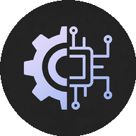
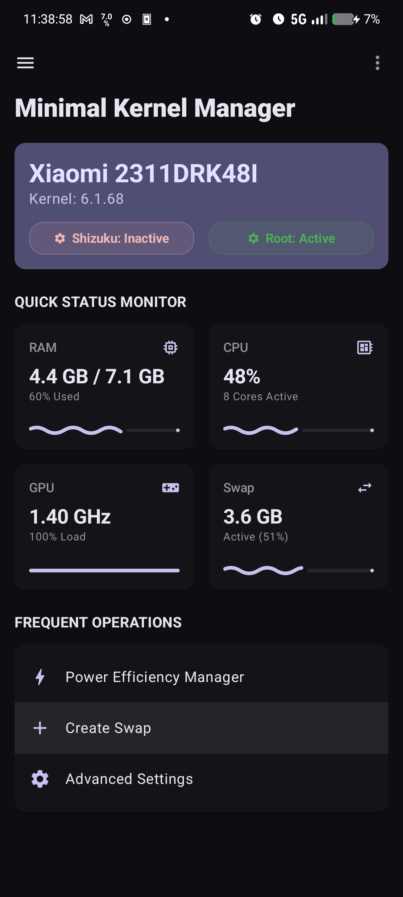
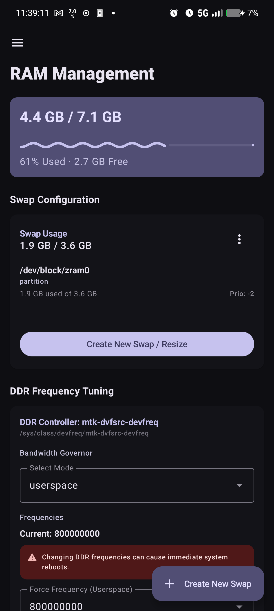
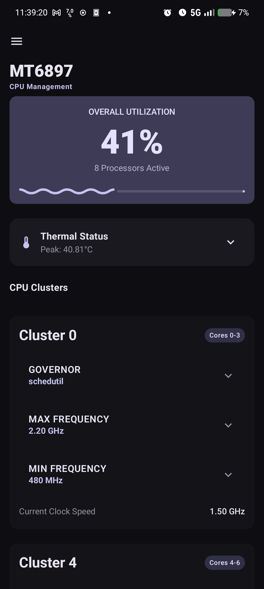
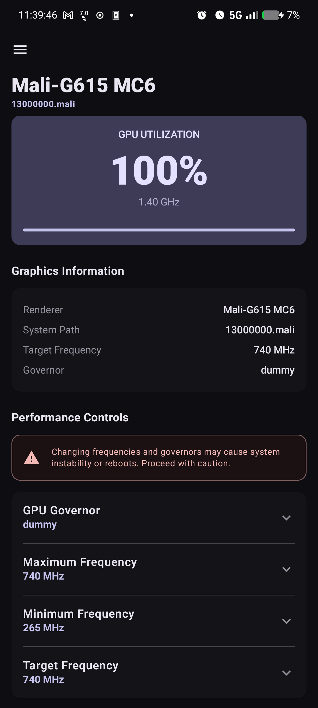
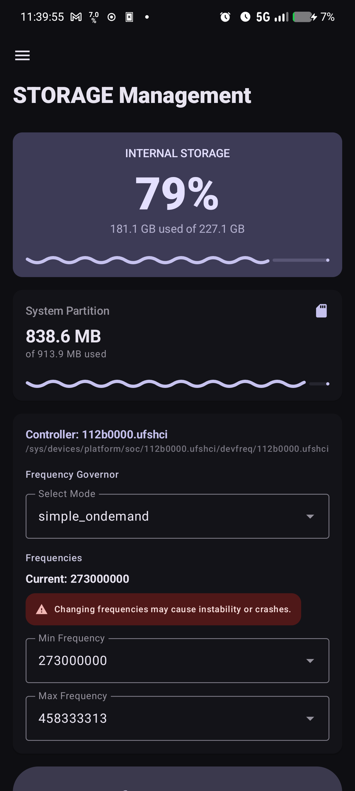
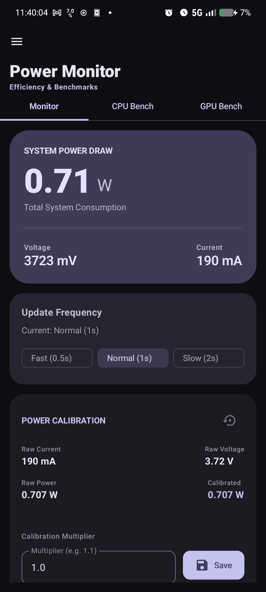
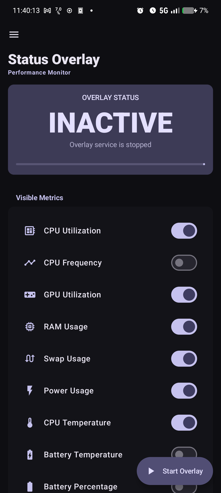
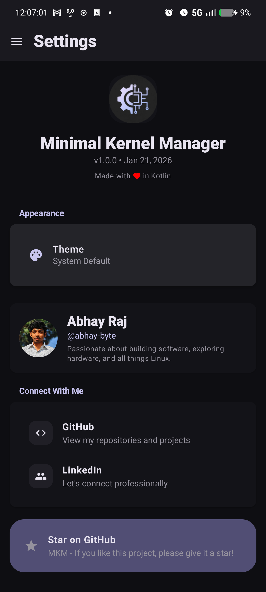

  
  
  # Minimal Kernel Manager (MKM)
  
  **Package:** `com.ivarna.mkm`
  
  Android kernel management and system monitoring application

  | | | | |
  | :---: | :---: | :---: | :---: |
  |  |  |  |  |
  |  |  |  |  |

---

## 🚀 Features

### 📊 Real-Time Performance Overlay
- **Customizable Floating Overlay**: Always-on-top system monitor with real-time metrics
- **Advanced Reordering**: Intuitive drag-and-drop component reordering with haptic feedback
- **Multiple Layout Modes**:
  - Vertical (default)
  - Grid View (1-4 columns with smart packing)
  - Horizontal Bar Layout
- **Visual Customization**:
  - 8 Material Design accent colors (Primary, Green, Blue, Red, Yellow, Pink, Purple, Cyan)
  - Background opacity control (20%-100%)
  - Icons-only mode for minimal footprint
  - Progress bars toggle (wavy Material 3 indicators)
  - Real-time Sparklines (historical trend charts)
- **Monitored Metrics**:
  - CPU Utilization (%)
  - CPU Frequency (per-cluster)
  - GPU Utilization (%)
  - RAM Usage (%)
  - Swap Usage (%)
  - Power Consumption (Watts)
  - CPU Temperature (°C)
  - Battery Temperature (°C)
  - Battery Percentage (%)
- **Overlay Control**:
  - Adjustable update frequency (100ms - 5000ms)
  - Movable or fixed positioning (9 anchor points)
  - Multi-stage warning colors (Normal, Warning 70%+, Critical 90%+)

### 💾 Persistent Swap Management
- **Swap File Creation**: Create persistent swap files with customizable sizes
- **Boot Persistence**: Automatically activates swap on device boot
- **Multiple Access Methods**: Works with Shizuku (non-root) or Root access
- **Swap Monitoring**: Real-time swap usage tracking and visualization

### ⚙️ System Management
- **CPU Control**: Per-cluster frequency and governor management
- **GPU Control**: Frequency scaling and governor configuration
- **Memory Monitoring**: Detailed RAM, cache, and buffer statistics
- **Thermal Monitoring**: Real-time temperature tracking for CPU and battery

### 🎨 Modern Material Design 3 UI
- **Jetpack Compose**: Fully native Compose UI with Material 3 components
- **Dark Theme**: Optimized dark color scheme
- **Expressive Animations**: Smooth transitions and interactive feedback
- **Navigation Rails**: Efficient multi-section navigation

---

## 🛠️ Technical Stack

- **Language**: Kotlin
- **UI Framework**: Jetpack Compose with Material 3
- **Build System**: Android Gradle Plugin 8.13.2
- **SDK**: Compile/Target SDK 36
- **NDK**: Version 29
- **Min SDK**: 24 (Android 7.0+)

## Building
1. Ensure Android SDK platform 36 and build tools plus NDK 29 are installed and configured in `ANDROID_HOME` / `ANDROID_SDK_ROOT`.
2. Make the wrapper executable if needed: `chmod +x ./gradlew`.
3. Build the app: `./gradlew assembleDebug`.

> Note: AGP 8.13.2 and SDK 36 may not be available in standard repos; if the build fails resolving them, adjust to available versions.

---

## 📱 Requirements

MKM requires elevated system access via one of the following methods:

| Method | Requirements | Notes |
|--------|--------------|-------|
| **Shizuku** | Android 11+ (wireless debugging) or Root | Recommended for non-root users |
| **Root** | Magisk, KernelSU, or other root solution | Full access without additional apps |
| **Sui** | Magisk module | Auto-detected with Shizuku API |

### Setting Up Shizuku (Non-Root)
1. Install [Shizuku](https://github.com/RikkaApps/Shizuku) from GitHub or Play Store
2. Follow the in-app setup guide (wireless debugging on Android 11+)
3. Grant MKM permission when prompted

---

## 📄 License

This project is licensed under the GNU General Public License v3.0 - see the [LICENSE](LICENSE) file for details.
