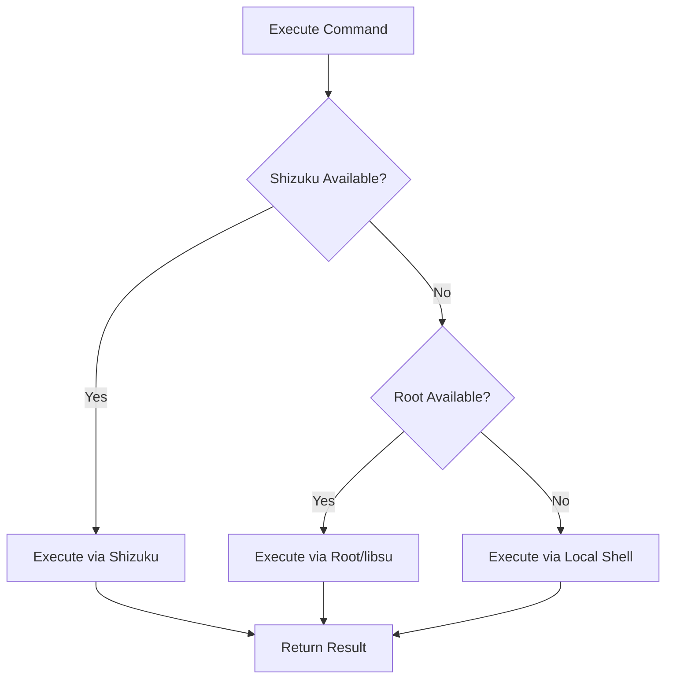

# Shizuku Integration - RAM Components Update

## Overview
Updated the MKM app to properly support Shizuku for RAM management operations. Shizuku provides elevated ADB shell access (uid=2000) without requiring root, making swap file operations accessible to more users.

## Changes Made

### 1. ShellManager Enhancement (`shell/ShellManager.kt`)

**Added Shizuku Support:**
- Added `SHIZUKU` to `AccessMethod` enum
- Implemented `execShizuku()` method for Shizuku command execution
- Implemented `execShizukuStreaming()` for streaming output
- Updated fallback chain: **Shizuku → Root → Local**

**New Methods:**
- `hasShizuku()` - Check if Shizuku is available
- `hasRoot()` - Check if root is available
- `hasElevatedAccess()` - Check either Shizuku or Root

**Priority Logic:**
```kotlin
Shizuku (uid=2000)  ← Preferred for non-root users
    ↓ fallback
Root (uid=0)        ← Fallback for rooted devices
    ↓ fallback
Local Shell         ← Limited, non-privileged access
```

### 2. RamViewModel Updates (`ui/viewmodel/RamViewModel.kt`)

**Improved Privilege Checking:**
- Replaced root-only checks with `ShellManager.hasElevatedAccess()`
- Now checks for both Shizuku and Root access
- Better error messages indicating Shizuku as an option

**Error Messages Updated:**
- Before: "Root access denied"
- After: "No elevated access. Please enable Shizuku or grant root access."

**Operations Protected:**
- `applySwap()` - Requires Shizuku or Root
- `disableSwap()` - Requires Shizuku or Root  
- `removeSwap()` - Requires Shizuku or Root

### 3. ShellScripts Documentation (`shell/ShellScripts.kt`)

**Added Compatibility Notes:**
```kotlin
/**
 * Shizuku Compatibility:
 * 
 * Working with Shizuku (uid=2000):
 * - File operations in /data/local/tmp and /data directories
 * - mkswap, swapon, swapoff, losetup commands
 * - Reading /proc and /sys files
 * 
 * Requires Root (uid=0):
 * - Operations in /system partition
 * - Some /sys write operations (device-dependent)
 */
```

## Shizuku Command Execution

### How It Works

```kotlin
// 1. Check what's available
val method = ShellManager.getAvailableMethod()
// Returns: SHIZUKU, ROOT, or LOCAL

// 2. Execute command
val result = ShellManager.exec("mkswap /data/local/tmp/swapfile")
// Automatically uses best available method

// 3. Check result
if (result.isSuccess) {
    // Command succeeded
}
```

### Behind the Scenes

When Shizuku is used:
```kotlin
val process = Shizuku.newProcess(
    arrayOf("sh", "-c", command),
    null, 
    null
)
// Runs as ADB shell (uid=2000) with elevated privileges
```

## RAM Page Components

### Swap File Operations with Shizuku

All swap operations now work with Shizuku:

**Create Swap:**
```bash
# Via Shizuku (uid=2000)
dd if=/dev/zero of=/data/local/tmp/swapfile bs=1M count=2048
mkswap /data/local/tmp/swapfile
swapon /data/local/tmp/swapfile
```

**Disable Swap:**
```bash
swapoff /data/local/tmp/swapfile
```

**Remove Swap:**
```bash
swapoff /data/local/tmp/swapfile  # or loop device
losetup -d /dev/loop0              # if loop device
rm -f /data/local/tmp/swapfile
```

### Permissions Required

| Operation | Local Shell | Shizuku (ADB) | Root |
|-----------|-------------|---------------|------|
| Read /proc/meminfo | ✅ | ✅ | ✅ |
| Create swap in /data | ❌ | ✅ | ✅ |
| mkswap command | ❌ | ✅ | ✅ |
| swapon command | ❌ | ✅ | ✅ |
| losetup (loop devices) | ❌ | ✅ | ✅ |
| Write to /sys | ❌ | ⚠️ (limited) | ✅ |

## User Experience

### Before Update
- User clicks "Create Swap"
- App checks root: ❌ Not available
- **Error**: "Root access denied"
- User cannot create swap

### After Update
- User clicks "Create Swap"
- App checks Shizuku: ✅ Available & Permitted
- Swap created successfully via Shizuku
- No root required!

### Error Messages

**If no elevated access:**
```
No elevated access. Please enable Shizuku or grant root access.
```

**If Shizuku not running:**
```
Shizuku service not running. Please start Shizuku app.
```

**If permission denied:**
```
Swap creation requires elevated access. Please enable Shizuku or grant root.
```

## Testing Shizuku Integration

### Prerequisites
1. Install Shizuku app
2. Start Shizuku (via wireless ADB or root)
3. Grant MKM permission in Shizuku

### Test Scenarios

**Test 1: Swap Creation**
```kotlin
// Should work with Shizuku
viewModel.applySwap("/data/local/tmp/swapfile", 2048)
// Expected: Success
```

**Test 2: Swap Disable**
```kotlin
// Should work with Shizuku
viewModel.disableSwap("/data/local/tmp/swapfile")
// Expected: Success
```

**Test 3: Swap Removal**
```kotlin
// Should work with Shizuku  
viewModel.removeSwap("/data/local/tmp/swapfile")
// Expected: Success
```

**Test 4: No Privileges**
```kotlin
// With Shizuku/Root disabled
viewModel.applySwap("/data/local/tmp/swapfile", 2048)
// Expected: Error message about enabling Shizuku
```

## Benefits

### For Users
- ✅ **No root required** for swap management
- ✅ Works on stock devices with Shizuku
- ✅ Safer than rooting (no warranty void)
- ✅ Easy to set up (wireless ADB on Android 11+)

### For Developers
- ✅ Larger user base (root + non-root users)
- ✅ Automatic fallback to root if available
- ✅ Clean abstraction via ShellManager
- ✅ No code changes needed for new operations

## Compatibility

### Android Versions
- **Android 11+**: Shizuku via wireless debugging (no root needed)
- **Android 6-10**: Shizuku via root or ADB over USB
- **All versions**: Root fallback always available

### Shizuku Modes
| Mode | UID | Capabilities | RAM Operations |
|------|-----|--------------|----------------|
| **ADB Mode** | 2000 | ADB shell privileges | ✅ Swap in /data |
| **Root Mode** | 0 | Full root access | ✅ Everything |

## Implementation Details

### Command Execution Flow



### Error Handling

```kotlin
try {
    if (!ShellManager.hasElevatedAccess()) {
        // Show clear error message
        _errorMessage.value = "Enable Shizuku or grant root"
        return
    }
    
    val result = ShellManager.exec(command)
    
    if (!result.isSuccess) {
        // Parse error from stderr/stdout
        _errorMessage.value = result.stderr.ifEmpty { 
            result.stdout.ifEmpty { "Unknown error" }
        }
    }
} catch (e: Exception) {
    _errorMessage.value = e.message
}
```

## Future Enhancements

### Planned
- [ ] Add Shizuku status indicator in RAM screen
- [ ] Show which method is being used (Shizuku/Root)
- [ ] Add "Start Shizuku" quick action button
- [ ] Optimize command batching for Shizuku

### Possible
- [ ] Cache Shizuku permission status
- [ ] Add Shizuku mode detection (ADB vs Root)
- [ ] Show UID in debug mode
- [ ] Add command execution statistics

## Known Limitations

### With Shizuku (ADB Shell)
1. Cannot modify /system partition (read-only)
2. Some /sys write operations depend on SELinux policy
3. Cannot change system properties (requires root)
4. Limited to files owned by shell or in accessible directories

### Workarounds
- Use /data/local/tmp for swap files (always writable by ADB)
- Check operation success and provide fallback paths
- Suggest root for operations that truly require it

## Related Files

- [ShellManager.kt](../app/src/main/java/com/ivarna/mkm/shell/ShellManager.kt)
- [ShizukuManager.kt](../app/src/main/java/com/ivarna/mkm/shell/ShizukuManager.kt)
- [RamViewModel.kt](../app/src/main/java/com/ivarna/mkm/ui/viewmodel/RamViewModel.kt)
- [ShellScripts.kt](../app/src/main/java/com/ivarna/mkm/shell/ShellScripts.kt)

## References

- [Shizuku Official](https://github.com/RikkaApps/Shizuku)
- [Shizuku API Docs](https://github.com/RikkaApps/Shizuku-API)
- [Android ADB Shell](https://developer.android.com/studio/command-line/adb)
